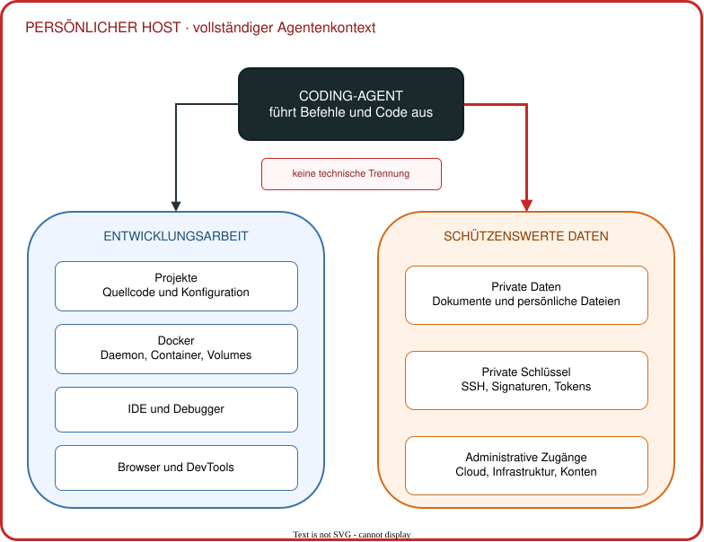
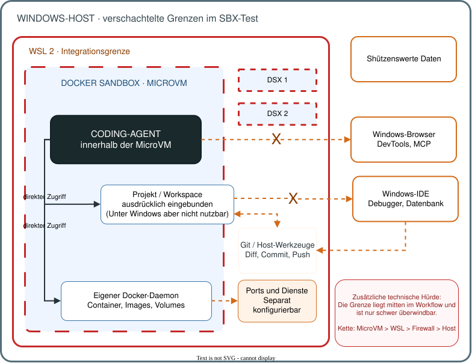
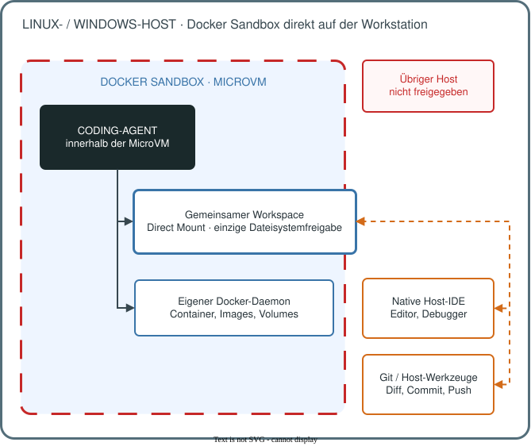
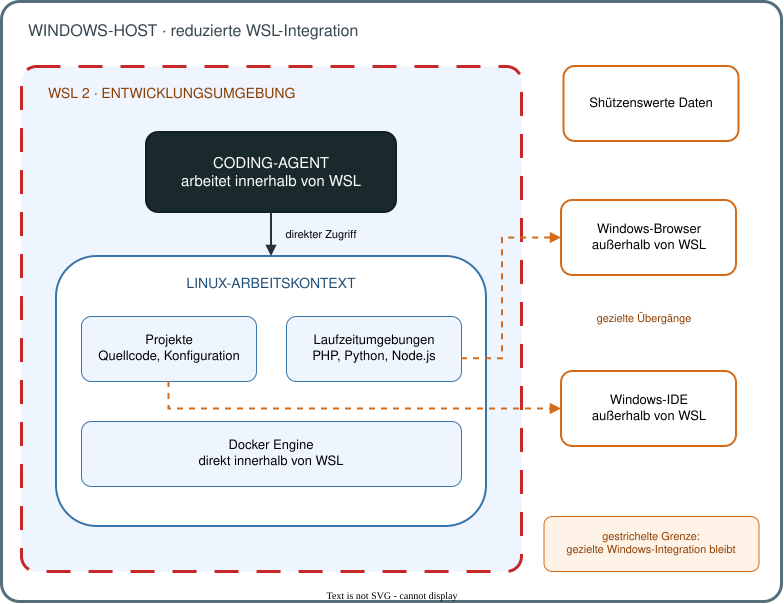
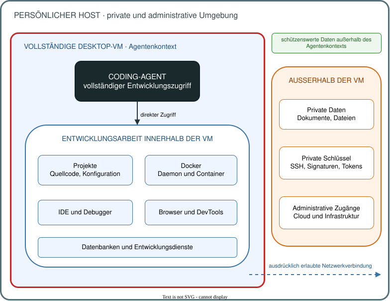

# Die Workstation ist die Sandbox für Coding-Agenten

Eine Sandbox um ein einzelnes Repository wirkt wie die naheliegende Sicherheitsgrenze für Coding-Agenten. Doch sobald Entwicklungsaufgaben Repository-, Dienst- und Desktop-Grenzen überschreiten, trennt sie oft genau den Arbeitskontext ab, den der Agent braucht. Dann kann eine isolierte Entwickler-Workstation die passendere Grenze sein.

<!-- more -->

Diese Schlussfolgerung ist keine allgemeine Absage an projektbezogene Sandboxes. Für abgeschlossene und standardisierte Projekte sind sie eine ernstzunehmende Option. Ein Test mit Docker Sandboxes zeigte jedoch die Spannung in einem heterogenen Multi-Projekt-Workflow deutlich: Die Isolation gegenüber dem Host war nachvollziehbar, die Integration in den konkreten Arbeitsablauf dagegen aufwendig. Der Beitrag untersucht daher, wie die Sicherheitsgrenze zum tatsächlichen Arbeitskontext passen muss und warum sie in einer heterogenen Entwicklungslandschaft größer als ein Repository sein kann.

Die geeignete Sicherheitsgrenze ist damit die kleinste Grenze, die den vollständigen notwendigen Arbeitskontext einer Aufgabe enthält und gleichzeitig schützenswerte Daten außerhalb hält.

## Repository und Laufzeitgrenze sind nicht dasselbe

Viele Beispiele für Coding-Agenten folgen einem geschlossenen Ablauf: Repository klonen, Abhängigkeiten installieren, Tests ausführen und die Änderung prüfen. Das ist ein sinnvoller Ausgangspunkt, beschreibt aber nicht jede Entwicklungsumgebung.

In meinem Alltag laufen PHP- und Symfony-Projekte, Python-Anwendungen sowie React- und Node.js-Projekte nebeneinander. Dazu kommen PostgreSQL, RabbitMQ, Docker Compose, Kubernetes und einzelne Werkzeuge auf dem Host. IntelliJ, Browser, DevTools und Remote-Debugging mit Xdebug gehören ebenfalls zum Arbeitsablauf. Manche APIs, Datenbanken und Dienste liegen in anderen Projekten oder werden extern betrieben.

Eine typische UI-Änderung zeigt das Problem: Ein React-Frontend ruft einen Symfony-Service auf. Dieser greift auf PostgreSQL zu und publiziert gegebenenfalls Nachrichten an RabbitMQ. Um einen Fehler vollständig zu untersuchen, muss der Agent ihn im Browser reproduzieren, die Netzwerkantwort in den DevTools prüfen, einen Breakpoint im PHP-Code erreichen und den korrigierten Ablauf erneut testen. Die Aufgabe beginnt in einem Frontend-Repository. Ihre Laufzeitgrenze umfasst aber Frontend, Backend, Datenbank, Queue, Browser, IDE und Debugger.

Ein Coding-Agent ist in diesem Verständnis nicht nur ein Werkzeug zur Dateibearbeitung. Er muss mindestens in der Lage sein,

- Quellcode zu untersuchen und zu bearbeiten,
- die Anwendung zu bauen oder zu starten,
- Tests auszuführen,
- Fehler zu reproduzieren und zu debuggen,
- das Ergebnis in der tatsächlichen Zielumgebung zu kontrollieren.

Bei UI-Arbeit gehören Browser, DevTools und eine visuelle Prüfung dazu. Ein Werkzeug, das Dateien ändern kann, aber nicht selbst bauen, ausführen und prüfen darf, bleibt hilfreich. Es arbeitet dann jedoch eher wie ein Editor mit LLM-Unterstützung als wie ein vollständiger Agent.

## Sicherheit beginnt mit der technischen Reichweite

Ein Agent führt generierten oder vom Modell ausgewählten Code aus. Selbst bei guten Schutzmechanismen bleiben Fehlinterpretationen, fehlerhafte Anweisungen und Prompt Injection realistische Risiken. Entscheidend ist deshalb nicht nur, welche Handlung der Agent ausführen *sollte*, sondern welche Systeme und Daten er technisch erreichen *kann*.

Coding-Agenten benötigen Dateisystem-, Shell- und Netzwerkzugriff, um praktisch nützlich zu sein. Anthropic beschreibt Containment deshalb als technische Begrenzung dessen, was ein Agent erreichen kann, etwa durch Sandboxes, virtuelle Maschinen und Egress-Kontrollen. Diese Grenze soll nicht allein auf dem Modellverhalten oder einzelnen Verbotsregeln beruhen. [@anthropicContainment] Welche konkrete Grenze dafür geeignet ist, bleibt eine Architekturentscheidung des jeweiligen Anwendungsfalls.

Dateisystem- und Netzwerkisolation gehören dabei zusammen. Ein abgeschottetes Dateisystem schützt keine Daten, die über erreichbare Dienste abgefragt werden können. Umgekehrt verhindert eine Egress-Regel nicht den Zugriff auf lokal eingebundene Schlüssel oder Host-Schnittstellen.


/// caption
Agent direkt auf dem persönlichen Host: Entwicklungswerkzeuge und schützenswerte Daten liegen innerhalb desselben erreichbaren Kontexts.
///

## Docker Sandbox im Multi-Projekt-Test

Docker Sandboxes, im Folgenden `sbx`, führen jeden Agenten in einer eigenen MicroVM mit eigenem Kernel, Docker-Daemon, Dateisystem und Netzwerk aus. Pakete, Images und Container bleiben grundsätzlich innerhalb dieser Umgebung. [@dockerSandboxes][@dockerSandboxesArchitecture]

Die Grenze besitzt bewusst eingerichtete Übergänge. Der wichtigste Übergang ist der Workspace selbst: Im standardmäßigen Direct-Mount-Modus liegt er schreibbar innerhalb der Agentenreichweite. Die MicroVM isoliert den übrigen Host, nicht die ausdrücklich eingebundenen Arbeitsdateien. Änderungen im Working Tree erscheinen unmittelbar auf dem Host. [@dockerSandboxesDefaults]

Der eigene Docker-Daemon ist dabei wesentlich: Wer einen klassischen Docker-Daemon kontrolliert, kann über Host-Mounts weitreichend auf den Rechner des Daemons zugreifen. Docker erlaubt diese Kontrolle daher nur vertrauenswürdigen Benutzern. [@dockerDaemonSecurity] OWASP rät davon ab, den Docker-Socket in Container durchzureichen, und stellt klar, dass auch ein read-only Mount das Problem nicht löst. [@owaspDockerSecurity]

Für die Bewertung sind zwei Betriebsmodi zu unterscheiden: `sbx` kann innerhalb von WSL oder direkt auf dem Host laufen. Beim direkten Host-Betrieb macht das Betriebssystem einen wesentlichen Unterschied. Deshalb werden Linux und Windows getrennt betrachtet.

### SBX innerhalb von WSL auf der Windows-Workstation

In diesem Aufbau liefen OpenCode und seine Weboberfläche in der Sandbox innerhalb von WSL. Ein Projektbereich und zusätzliche OpenCode-Konfiguration waren eingebunden, `opencode serve` war über einen freigegebenen Port erreichbar. Browser und IDE liefen nativ unter Windows.

Die MicroVM erfüllte ihren Zweck: Der Agent kontrollierte den Docker-Daemon der Sandbox, nicht den privilegierten Daemon des Hosts. Für ein weitgehend geschlossenes Projekt ist das eine starke und verständliche Grenze.

Im heterogenen Multi-Projekt-Workflow lag diese Grenze jedoch mitten im Arbeitsablauf. Remote-Debugging mit Xdebug ließ sich nicht mit vertretbarem Aufwand in den bestehenden Prozess integrieren. Projektübergreifende Dienste brauchten zusätzliche Verbindungen. Browser-DevTools und das zugehörige MCP auf dem Windows-Host blieben außerhalb. Provider-Login, Weboberfläche und Datenbankzugriffe erforderten weitere Portfreigaben.

Hinzu kam die Kette Sandbox > WSL > Windows-Firewall > IDE / Browser. Jeder Übergang war einzeln lösbar. Zusammen verhinderten sie jedoch, dass der Agent die vollständige Problemumgebung selbstständig erreichte. Für UI-Arbeit und verteiltes Debugging war das eine erhebliche Einschränkung.


/// caption
Docker Sandbox innerhalb von WSL: Agent, Projekt und Docker-Daemon liegen in der MicroVM; Windows-IDE, Browser und projektübergreifende Dienste erfordern zusätzliche Übergänge.
///

Dieser Test sagt nichts gegen Docker Sandboxes im Allgemeinen aus. Er zeigt den Integrationspreis eines Aufbaus, in dem WSL und die Sandbox zwei aufeinanderfolgende Grenzen bilden und die Sandbox-Grenze kleiner als die Laufzeitgrenze der Aufgabe bleibt.

Docker Sandboxes können solche Grenzen grundsätzlich überbrücken: Unter anderem lassen sich mehrere Workspaces einbinden, Ports weiterleiten, Host-Services anbinden, MCP-Verbindungen über ein Gateway führen und externe IDEs über SSH anbinden. Das Problem ist daher nicht die grundsätzliche technische Machbarkeit. In meinem Workflow müssen diese Übergänge jedoch zusätzlich über die Sandbox-Grenze konfiguriert werden. Damit wandert Komplexität in Workspace-, Netzwerk-, Port- oder Remote-IDE-Konfiguration, die beim nativen Entwicklungsworkflow nicht vorhanden ist.

### SBX direkt auf dem Host

Direkt auf der Workstation entfällt die zusätzliche WSL-Schicht um `sbx`. Wie gut dieser Aufbau zum Entwicklungsprozess passt, hängt dann vor allem vom Host-Betriebssystem und vom Speicherort des Workspace ab.


/// caption
Docker Sandbox direkt auf der Workstation: Agent und eigener Docker-Daemon bleiben in der MicroVM; nur der Workspace wird mit nativer Host-IDE, Git und anderen Host-Werkzeugen geteilt.
///

#### Linux-Workstation

Auf einem Linux-Host ist das Modell deutlich attraktiver. Der Agent bleibt innerhalb seiner MicroVM, während IDE, Git und andere Host-Werkzeuge denselben Linux-Workspace verwenden. Es gibt keine zusätzliche Windows-/Linux-Dateisystemgrenze. Für passende lokale Projekte entsteht so eine gute Balance zwischen Isolation und Integration. [@dockerSandboxesIsolation]

Zusätzliche Arbeit bleibt trotzdem. Ports, Netzwerkzugriffe, Zugangsdaten und Verbindungen zu lokalen Diensten müssen passend zum jeweiligen Projekt freigegeben werden. Auch Werkzeuge und Laufzeitabhängigkeiten sind pro Sandbox bereitzustellen. Für abgeschlossene lokale Projekte ist dieser Aufwand überschaubar, bei vielen heterogenen Projekten wächst er entsprechend. [@dockerSandboxesCredentials][@dockerSandboxesWorkflows]

Der gemeinsame Workspace ist auch unter Linux kein nativer Bind Mount in einen Linux-Container. SBX reicht ihn über die MicroVM-Grenze durch. Dieser zusätzliche Pfad kostet unter Linux Dateisystemleistung; ein nativer Bind Mount auf dem Linux-Host bleibt schneller. Eine klassische Dateisynchronisation findet dabei nicht statt, Änderungen sind unmittelbar auf beiden Seiten sichtbar. Das auf allen unterstützten Betriebssystemen standardmäßig aktive VirtioFS-Caching reduziert den Overhead, beseitigt ihn aber nicht. [@dockerSandboxesArchitecture]

#### Windows-Workstation

Auch unter Windows kann `sbx` direkt auf dem Host laufen. Es verwendet die Windows Hypervisor Platform und benötigt weder Docker Desktop noch Docker Engine. [@dockerSandboxesInstall]

Mein Entwicklungsworkflow passt jedoch nicht gut zu diesem Modell. IntelliJ läuft nativ unter Windows, PHP/Symfony, Python, JavaScript/Node, Docker sowie die Build-, Test- und Watcher-Prozesse sind dagegen Linux-zentriert. Beim hier betrachteten direkten Windows-Betrieb liegt der gemeinsam genutzte Workspace auf dem Windows-Dateisystem. Damit verlöre der Stack seine bisherige Linux-Dateisystemumgebung.

Relevant sind dabei nicht vollständige Unix-Berechtigungen, denn diese verwaltet Git nicht. Bei regulären Dateien berücksichtigt Git aber insbesondere das Executable-Bit. Auch diese Linux-relevante Dateieigenschaft muss beim Checkout zuverlässig erhalten bleiben. [@gitCoreFileMode]

JetBrains unterstützt Dev Containers. Das native Öffnen eines solchen Projekts ist laut aktueller Dokumentation weiterhin in Entwicklung und besitzt Einschränkungen. [@jetbrainsDevContainerNative] IntelliJ ist damit nicht grundsätzlich inkompatibel mit Containern. In meinem Workflow soll die IDE aber nativ auf dem Host bleiben; eine zusätzliche Container-IDE-Schicht würde den bestehenden Ablauf verändern.

Der Windows-Workspace wäre für die native IDE direkt erreichbar. Für den Linux-zentrierten Stack ist er jedoch die schlechtere Grundlage. Zusätzlich reicht SBX auch diesen Workspace per Filesystem-Passthrough in die MicroVM durch. Es findet keine klassische Dateisynchronisation statt, der dokumentierte Dateisystem-Overhead bleibt aber bestehen. [@dockerSandboxesArchitecture]

`sbx` direkt auf Windows ist technisch möglich. In meiner Konstellation ist es dennoch keine sinnvolle Alternative: Die native Windows-IDE, Linux-Workspace und -Toolchain sowie die MicroVM erzeugen zusätzliche Systemgrenzen. Browserzugriff, Debugging, MCP, mehrere Projekte und externe Dienste lassen sich grundsätzlich verbinden, benötigen dafür aber zusätzliche Brücken und Konfiguration. Damit würde `sbx` gerade den Entwicklungsworkflow erschweren, dessen vollständiger Kontext dem Agenten zur Verfügung stehen soll.

Das ist eine Bewertung dieses heterogenen Entwicklungsworkflows und keine allgemeine Aussage gegen Docker Sandboxes auf Windows. Für die im Artikel beschriebene Konstellation ist `sbx` auf dem Windows-Host keine praktische Option, weil der notwendige Integrationsaufwand den Workflow unnötig erschwert.

### Git als Kontrollgrenze

Unabhängig vom Betriebsmodus darf der Agent Quellcode bearbeiten und Git zur lokalen Analyse verwenden. Diff-Prüfung und Push in das zentrale Repository bleiben manuell. Dieser Guard funktioniert nur, wenn Git-, Credential- und Netzwerkkonfiguration keine Push-Berechtigung in die Agentenreichweite geben.

Der Speicherort des privaten Schlüssels reicht dafür nicht aus. SBX kann den Host-SSH-Agenten weiterreichen: Der Schlüssel bleibt auf dem Host, Prozesse in der Sandbox können aber Signaturen und SSH-Authentifizierung anfordern. Docker dokumentiert alternativ einen Host-Worktree-Workflow, in dem der Agent Dateien ohne Git-Zugriff bearbeitet und Commit sowie Push anschließend auf dem Host erfolgen. [@dockerSandboxesCredentials][@dockerSandboxesWorkflows]

### Templates und Kits lösen keine Grenzfrage

Docker unterscheidet zwei Mechanismen zur Anpassung von Sandboxes. Templates sind wiederverwendbare Sandbox-Images, in denen Werkzeuge, Pakete und Konfigurationen vorbereitet werden. [@dockerSandboxesTemplates] Kits sind derzeit experimentelle, deklarative YAML-Artefakte. Sie können einen vorhandenen Agenten um Werkzeuge, Dateien, Umgebungsvariablen, Zugangsdaten- und Netzwerkregeln erweitern oder einen neuen Agenten definieren. Templates und Kits lassen sich kombinieren: Das Template stellt die Basisumgebung bereit, während das Kit veränderliche Konfiguration und Laufzeitregeln ergänzt. [@dockerSandboxesCustomize]

Beide Mechanismen reduzieren wiederholte Einrichtungsarbeit. Sie ändern jedoch nicht, welche Komponenten eine Aufgabe benötigt oder wo die Sandbox-Grenze verläuft. Die internen Docker-Daemons führen jeweils eigenen Zustand und Image-Cache; auch Paketinstallationen bleiben sandbox-spezifisch. Mehrere Sandboxes teilen ihre Images und Layer nicht automatisch. [@dockerSandboxesArchitecture]

Für umfangreiche Entwicklungsabhängigkeiten bleiben in der Praxis drei Strategien:

| Strategie | Konsequenz |
| --- | --- |
| Eigenes Template je Projekt | Viele ähnliche, aber getrennt zu pflegende Umgebungen |
| Universelles Template | Ein wachsender Tool-Zoo in jeder Sandbox |
| Installation bei Bedarf | Langsamere Starts, weniger Reproduzierbarkeit und zusätzlicher Updateaufwand |

Kits können veränderliche oder projektspezifische Konfiguration aus dem Template herauslösen, ohne dafür jedes Mal ein neues Image zu bauen. Sie lösen jedoch nicht den Grenzkonflikt des beschriebenen Multi-Projekt-Setups. Im ungünstigsten Fall landen die benötigten Entwicklungsabhängigkeiten weiterhin in mehreren projektspezifischen Sandboxes. Das erschwert die Wartung und bindet durch doppelte Installationen, Images und Layer zusätzliche Ressourcen.

Keine dieser Strategien ist grundsätzlich falsch. Bei standardisierten Projekten kann ein projektspezifisches Template sinnvoll sein. Der zusätzliche Wartungs- und Ressourcenaufwand ist daher keine allgemeine Eigenschaft von Templates oder Kits, sondern eine Folge des hier beschriebenen heterogenen Multi-Projekt-Setups.

## Den Arbeitskontext isolieren

Die Alternative besteht nicht darin, den Agenten direkt auf einem persönlichen Host mit privaten Schlüsseln, Dokumenten und administrativen Zugangsdaten arbeiten zu lassen. Das Architekturprinzip lautet vielmehr:

> Nicht den Agenten vom Arbeitskontext isolieren, sondern den gesamten Arbeitskontext von den schützenswerten Daten.

## WSL 2 als leichtere Windows-Variante

Unter Windows kann eine bewusst reduzierte WSL-2-Integration eine pragmatische Variante dieses Modells sein. Eine minimale Ausgangskonfiguration in `/etc/wsl.conf` deaktiviert automatische Komfortbrücken:

```ini
[automount]
enabled=false
mountFsTab=false

[interop]
enabled=false
appendWindowsPath=false
```

Damit werden Windows-Laufwerke nicht automatisch eingebunden, `/etc/fstab` beim Start nicht verarbeitet, Windows-Prozessstarts aus Linux deaktiviert und Windows-Pfade nicht automatisch übernommen. Manuelle Mounts bleiben möglich; außerdem kann Windows weiterhin auf die Distribution zugreifen. Die Konfiguration reduziert Übergänge, macht WSL aber nicht zu einer eigenständigen VM-Sicherheitsgrenze. [@microsoftWSLConfig][@dockerDesktopWSL]

Das Netzwerk ist eine eigene Teilgrenze. WSL verwendet standardmäßig NAT; alternativ verbindet Mirrored Networking Windows und WSL anders miteinander. Welche Übergänge erreichbar sind, hängt daher vom Modus und den zugehörigen Firewall-Regeln ab. [@microsoftWSLNetworking]

Die Docker Engine läuft für dieses Modell direkt innerhalb der Distribution. Kontrolliert der Agent einen klassischen Docker-Daemon, erhält er weitreichende Rechte innerhalb dieser Distribution. [@dockerDaemonSecurity] Rootless Docker betreibt Daemon und Container ohne Root-Rechte und reduziert damit die Daemon-Privilegien, bildet aber keine zusätzliche Grenze zu Windows. [@dockerRootless] **Docker Desktop wird in diesem Modell bewusst vermieden:** Es läuft in der eigenen `docker-desktop`-Distribution und verbindet Distributionen mit aktivierter WSL-Integration. Docker beschreibt das als Teil des bestehenden WSL-Sicherheitsmodells; der Verzicht folgt hier allein meinem strengeren Architekturprinzip, keine weitere Steuerverbindung über die gewählte Grenze einzurichten. [@dockerDesktopWSL]


/// caption
Reduzierte WSL-Integration: Agent, Projekte, Laufzeitumgebungen und Docker liegen innerhalb von WSL; Windows-IDE und Browser bleiben über gezielte Übergänge nutzbar.
///

## Vollständige Desktop-VM

Ich setze das Architekturprinzip mit einer virtuellen Entwickler-Workstation um. In der Desktop-VM liegen Agent, IDE, Browser und DevTools, Docker Engine, Laufzeitumgebungen, Projekte sowie die benötigten Datenbanken und Dienste. Private Daten und administrative Zugänge des Hosts werden nicht eingebunden.


/// caption
Vollständige Desktop-VM: Der Entwicklungs- und Agentenkontext liegt innerhalb der VM, private Daten und administrative Zugänge bleiben auf dem Host außerhalb.
///

Innerhalb der VM darf der Agent weitreichend arbeiten: Er kann Docker steuern, Debugger nutzen, Browser prüfen und mehrere Projekte untersuchen. Kontrolliert der Agent den Docker-Daemon im Gast, erhält er damit weitreichende Kontrolle über den Gast, nicht automatisch über den Host. [@dockerDaemonSecurity] Das gilt nur, solange keine Host-Verzeichnisse, Geräte oder privilegierten Host-Schnittstellen durchgereicht werden und Netzregeln den Zugriff auf Host- und Administrationsdienste begrenzen. [@libvirtQemuDriver]

Eine KVM/QEMU-VM bildet eine eigenständige Systemgrenze zwischen Gast und Host, ist aber keine unüberwindbare Barriere. Ihre Wirkung hängt unter anderem von Hypervisor-Konfiguration, Updates, virtueller Hardware, Freigaben, Passthrough-Geräten und Netzwerkregeln ab. Libvirt dokumentiert dafür unter anderem die Begrenzung von QEMU-Prozessen durch SELinux beziehungsweise AppArmor und sVirt. [@libvirtQemuDriver]

Die Desktop-VM benötigt zusätzliche Ressourcen und einen eigenen Updatezyklus; Grafik, mehrere Monitore und Dateifreigaben können Reibung erzeugen. In meinem Workflow wiegt dieser zentrale Pflegeaufwand jedoch geringer als die wiederholte Integration vieler projektspezifischer Sandboxes.

## Die Grenze muss zum Arbeitsablauf passen

Die Wahl ist keine abstrakte Rangfolge von "sicher" bis "unsicher". Sie ist eine Abwägung zwischen technischer Reichweite, Integration in den Arbeitsablauf, dauerhaftem Pflegeaufwand und der Bedienbarkeit für die jeweilige Zielgruppe.

| Ansatz | Grenze gegenüber dem Host | Integration im beschriebenen Workflow | Pflegeaufwand | Bedienmodell / Einstiegshürde |
| --- | --- | --- | --- | --- |
| Agent direkt auf dem persönlichen Host | Keine separate Systemgrenze | Sehr hoch | Gering | Gering, bestehende Desktop-Werkzeuge direkt nutzbar |
| Docker Sandbox direkt auf dem Host | MicroVM-Grenze; Workspace bleibt im Direct Mode gemeinsam erreichbar [@dockerSandboxesIsolation] | Unter Linux für passende lokale Projekte hoch; unter Windows im beschriebenen Linux-zentrierten Workflow gering | Unter Linux mittel; unter Windows im beschriebenen Workflow hoch | Host-IDE bleibt nutzbar; unter Windows zusätzlicher Konflikt zwischen Host-Werkzeugen und Linux-Workspace |
| Docker Sandbox innerhalb von WSL | MicroVM innerhalb einer zusätzlichen WSL-Grenze | Im Test gering | Unter Windows bei heterogenen Stacks sehr hoch | Zusätzliche Übergänge zwischen Sandbox, WSL und Windows-Desktop |
| Reduzierte WSL-2-Integration | Konfigurationsabhängige Grenze mit verbleibender Windows-Integration [@microsoftWSLConfig][@microsoftWSLNetworking][@dockerDesktopWSL] | Hoch, wenn der Arbeitskontext in WSL liegt | Mittel | Linux- und terminalorientierter Arbeitskontext; Windows-GUI bleibt über Übergänge nutzbar |
| Desktop-VM | Separate VM-Grenze; Freigaben, Passthrough und Netzwerk bestimmen verbleibende Übergänge [@libvirtQemuDriver] | Sehr hoch | Mittel | Vollständiger Desktop-Workflow innerhalb derselben Grenze möglich |

### Bedienmodell und Adoption

**Eine technisch funktionierende Agentenumgebung ist nicht automatisch eine leicht zugängliche Arbeitsumgebung. Wenn der konkrete Aufbau zusätzliche Wechsel in Richtung Terminal oder TUI verlangt, kann dies insbesondere für Non-Developer eine relevante Adoptionshürde darstellen.**

Das ist weder ein Sicherheitsurteil noch eine grundsätzliche Bewertung von TUI gegenüber grafischen Oberflächen. Im beschriebenen Workflow können der direkte Host-Betrieb und die vollständige Desktop-VM das bestehende grafische Bedienmodell innerhalb eines gemeinsamen Kontexts erhalten. Projektbezogene Sandboxes und die reduzierte WSL-Integration erforderten in diesem Aufbau dagegen zusätzliche Übergänge oder eine stärker terminalorientierte Bedienung. Je stärker IDE, Browser und andere Desktop-Werkzeuge den bestehenden Ablauf prägen, desto relevanter wird dieser Unterschied für Bedienbarkeit und Adoption.

Der direkte Host-Betrieb bietet vollständige Integration, trennt im beschriebenen Bedrohungsmodell aber private und administrative Daten nicht vom Agenten. Docker Sandbox, reduzierte WSL-Integration und Desktop-VM ziehen unterschiedliche Grenzen und lassen unterschiedliche Übergänge zu. Die Tabelle bildet deshalb keine Rangfolge ab; entscheidend ist ihre Passung zum benötigten Arbeitskontext.

Keine Tabellenzelle ersetzt ein konkretes Bedrohungsmodell. Vor der Entscheidung sind mindestens vier Fragen zu beantworten:

- Welche Projekte, Dienste und Desktop-Werkzeuge benötigt die Aufgabe tatsächlich?
- Welche Host-Daten und administrativen Systeme dürfen niemals erreichbar sein?
- Welche Dateisystem-, Netzwerk- und Kontrollpfade überschreiten die Grenze?
- Wie hoch ist der dauerhafte Aufwand, diese Übergänge zu prüfen und zu pflegen?

## Fazit

Repository-Grenze und Laufzeitgrenze sind nicht zwangsläufig identisch. Die entscheidende Frage lautet daher: Welche Umgebung braucht der Agent, um eine Aufgabe vollständig auszuführen, und welche Daten müssen außerhalb dieser Umgebung bleiben? Eine geeignete Sicherheitsgrenze schließt den notwendigen Arbeitskontext ein und hält schützenswerte Daten außerhalb.

Docker Sandboxes bleiben für abgeschlossene Projekte eine ernstzunehmende Option. Direkt auf einer Linux-Workstation kann dieses Modell noch attraktiver sein: MicroVM-Isolation und ein gemeinsam nutzbarer Linux-Workspace lassen sich dort verbinden, ohne eine zusätzliche Betriebssystemgrenze in den Entwicklungsprozess einzuführen.

In meiner Windows-Konstellation gilt das dagegen nicht. Der bestehende Workflow kombiniert eine native Host-IDE mit einem Linux-Workspace und Linux-zentrierten Laufzeitwerkzeugen. SBX direkt auf Windows würde diesen Aufbau nicht vereinfachen, sondern eine weitere Dateisystem- und Integrationsgrenze hinzufügen. Für diesen Anwendungsfall ist es deshalb keine praktische Alternative zur isolierten Entwickler-Workstation.

Im beschriebenen heterogenen Multi-Projekt-Workflow trennte die projektbezogene Grenze zudem benötigte Werkzeuge und Verbindungen ab. Hier hat sich eine vollständige virtuelle Entwickler-Workstation bewährt: nicht als allgemeingültig beste Lösung, sondern weil ihre Grenze den gesamten benötigten Arbeitskontext umfasst.

Neben technischer Reichweite und Integrationsaufwand muss die gewählte Grenze deshalb auch zum Bedienmodell und zur Zielgruppe passen.
