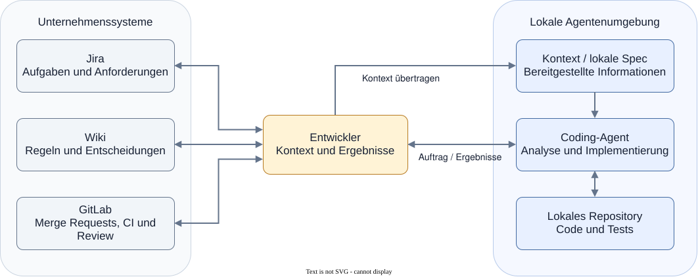
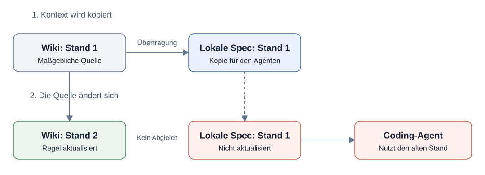
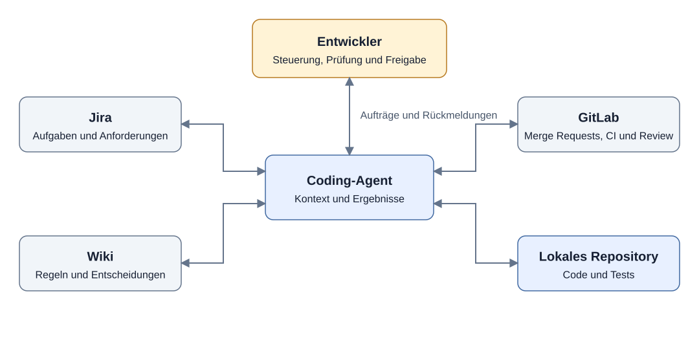

# Wenn der Entwickler zum Integrationslayer für den Coding-Agenten wird

Coding-Agenten können Code analysieren, Änderungen implementieren und Tests ausführen. Liegt der benötigte Kontext jedoch in unerreichbaren Tickets, Wikis und Reviewdiskussionen, muss der Entwickler die Verbindung herstellen. Dabei können neben den bestehenden Quellen neue Spezifikationen, Informationskopien und Arbeitsabläufe entstehen. Dieses Modell zeigt, wie lokale Automatisierung zusätzlichen Integrationsaufwand erzeugt und weshalb eine AI-Transformation die vor- und nachgelagerten Prozesse stärker in den Mittelpunkt stellen sollte.

<!-- more -->

## Coding-Agenten treffen auf bestehende Informationslandschaften

In kleinen oder organisatorisch wenig fragmentierten Umgebungen fällt die Einbindung eines Coding-Agenten häufig leichter. Anforderungen, Architekturentscheidungen und Quellcode liegen nahe beieinander. Dieselben Personen überblicken die relevanten Informationen und können sie innerhalb eines überschaubaren Arbeitskontexts bereitstellen.

Mit zunehmender organisatorischer Fragmentierung verändert sich diese Ausgangslage. Ein Ticket beschreibt die gewünschte Änderung, eine Wiki-Seite erläutert die fachlichen Regeln und eine frühere Reviewdiskussion erklärt, warum eine naheliegende Lösung bereits verworfen wurde. Für die Implementierung werden Informationen aus mehreren Systemen benötigt.

Diese Form der Wissensarbeit bestand bereits vor Coding-Agenten. Ko, DeLine und Venolia untersuchten die Informationsbedürfnisse von Entwicklern bei Microsoft. Ihre Studie beschreibt unter anderem die Suche nach Designentscheidungen und erwartetem Programmverhalten sowie Unterbrechungen, wenn benötigtes Wissen nur bei nicht verfügbaren Kollegen lag. [@koInformationNeeds2007]

Das folgende Modell betrachtet die Übernahme einer Entwicklungsaufgabe, Implementierung und Review bis zur Übergabe in die Auslieferung. Produktplanung und Betrieb bleiben außerhalb. Es beschreibt eine mögliche Integrationskonstellation und ihre Folgen, ohne eine Aussage über deren Häufigkeit zu treffen.

## Der Entwicklerarbeitsplatz ist eine Informationskette

Ein vereinfachter Ablauf beginnt mit einem Jira-Ticket. Der Entwickler liest ergänzende Anforderungen in Confluence, untersucht frühere Merge Requests in GitLab und gleicht diese Informationen mit dem vorhandenen Code ab. Anschließend bearbeitet er seine lokale Repository-Kopie. Die Änderung geht zurück nach GitLab, durchläuft CI und Review und wird zur Auslieferung freigegeben.

**Jira → Confluence / Wiki → GitLab-Kontext → lokale Entwicklung → GitLab / CI / Review → Delivery**

Die Produktnamen stehen beispielhaft für Systemrollen. Entscheidend sind die Übergänge zwischen Aufgabenverwaltung, organisatorischem Wissen, lokaler Bearbeitung und gemeinsamer Prüfung. Tatsächlich verläuft die Arbeit mit Rückfragen und Rückkopplungen zwischen diesen Stationen.

Dabei muss zwischen der **lokalen Repository-Kopie** und dem **zentralen Entwicklungssystem** unterschieden werden. Ein lokaler Checkout enthält Quellcode, versionierte Dokumentation und gegebenenfalls Git-Historie. Ticketdiskussionen, Merge-Request-Kommentare, Freigaben und Ergebnisse zentraler CI-Läufe gehören jedoch nicht automatisch dazu. Zugriff auf den lokalen Code erschließt deshalb nur einen Teil des Arbeitskontexts.

Der Entwickler verbindet diese Quellen bereits heute: Er sucht, vergleicht, bewertet und entscheidet. Diese fachliche Arbeit bildet die Grundlage einer sinnvollen Änderung. Wird nun ein Agent ausschließlich in die lokale Entwicklung eingebunden, entsteht eine zusätzliche Übergabe. Der Entwickler muss den verstandenen Kontext ausdrücklich formulieren und innerhalb der Agentenumgebung verfügbar machen.

## Die agentische Automatisierungsinsel

Die Integration isolierter Automatisierung ist ein bekanntes Organisationsproblem. Bereits 1989 veröffentlichten Hale, Haseman und Groom einen Beitrag unter dem Titel „Integrating Islands of Automation“. [@haleIntegratingIslands1989] Auch die Lean-Perspektive richtet die Verbesserung auf den gesamten Wertstrom: Womack beschreibt ausdrücklich, weshalb die Optimierung einzelner Maschinen oder Prozessschritte als Betrachtungsrahmen zu kurz greift. [@womackLeanThinking2006]

Bei Coding-Agenten lässt sich eine entsprechende Konstellation beschreiben: Innerhalb der lokalen Entwicklungsumgebung arbeitet der Agent mit Code und Werkzeugen. Die Systeme, aus denen Anforderungen, Entscheidungen und Rückmeldungen stammen, bleiben außerhalb seiner Reichweite. Der Entwickler verbindet beide Seiten.

/// caption
Der Entwickler vermittelt Kontext und Ergebnisse zwischen den Unternehmenssystemen und dem lokal arbeitenden Coding-Agenten.
///

Der Entwickler stellt Kontext bereit, steuert den Agenten und prüft dessen Ergebnisse. Auch ihre Rückführung in die gemeinsamen Systeme und die Begleitung der Auslieferung bleiben seine Aufgabe.

Die Trennung der Systeme kann sachliche Gründe haben: unterschiedliche Zuständigkeiten, Zugriffsrechte oder Schutzanforderungen. Für Informationen außerhalb der Reichweite des Agenten muss dann ein anderer Bereitstellungsweg eingerichtet werden.

Zur **agentischen Automatisierungsinsel** wird dieser Aufbau als Anti-Pattern, wenn die Organisation die lokale Implementierung optimiert, wiederkehrende manuelle Übergaben aber als unbeachtete Dauerlösung bestehen lässt. Die Geschwindigkeit innerhalb der Insel ist sichtbar; der Aufwand ihrer Verbindung mit dem übrigen Prozess bleibt außerhalb der Bewertung.

## Shadow Processes und Shadow Artifacts

Fehlender Zugriff führt bei generativen Systemen nicht zwangsläufig zum Stillstand. Entwickler und Agent können innerhalb der erreichbaren Umgebung zusätzliche Arbeitsgrundlagen schaffen. Aus einem Ticket wird eine lokale Feature-Spezifikation. Aus Wiki-Seiten entsteht eine Zusammenfassung. Entscheidungen aus Reviewdiskussionen werden in Kontextdateien übernommen.

Diese Ableitungen machen Informationen für den Agenten nutzbar. Bei dauerhafter Nutzung entsteht jedoch eine weitere Ebene der Informationshaltung. Zwei Begriffe beschreiben den Zusammenhang:

- **Shadow Processes** sind zusätzliche Übertragungs-, Aufbereitungs- und Abgleichsabläufe, die für den Agenteneinsatz erforderlich werden, im gemeinsamen Prozess aber keine klare Zuständigkeit oder Sichtbarkeit besitzen.
- **Shadow Artifacts** sind dauerhaft weiterverwendete Informationskopien, die neben einer maßgeblichen Quelle bestehen und deren Herkunft, Gültigkeit oder Aktualisierung unzureichend geregelt ist.

Im Modell wird aus **Wiki → Entwickler → Agent** beispielsweise **Wiki → Entwickler → lokale Spec → Agent**. Sobald die Spec für weitere Aufgaben verwendet wird, muss jemand ihre Beziehung zum Wiki pflegen. Wird dort eine fachliche Regel geändert, während die lokale Spec unverändert bleibt, arbeitet der Agent möglicherweise mit einem veralteten Stand. Eine anschließende lokale Korrektur kann die Abweichung weiter vergrößern, wenn sie nicht in die maßgebliche Quelle zurückfließt.

/// caption
Ohne geregelten Abgleich bleibt die lokale Kopie auf dem alten Stand, während sich die maßgebliche Quelle weiterentwickelt.
///

Das zugrunde liegende Konsistenzproblem ist aus der Dokumentationsforschung bekannt. Luciv und Kollegen untersuchen nahezu identische Textfragmente, die aus einer gemeinsamen Quelle kopiert und später unterschiedlich verändert wurden. Solche Duplikate erschweren die Nutzung und Pflege von Softwaredokumentation. [@lucivNearDuplicates2017] Auf das Modell übertragen entsteht ein entsprechendes Risiko, sobald organisatorische Informationen in unabhängig gepflegte Agentenkontexte kopiert werden.

Eine lokale Spezifikation kann dagegen eine bewusst versionierte Arbeitsgrundlage sein. Sind Quelle, Gültigkeitsstand und Aktualisierungsverfahren festgelegt, ist eine spätere Abweichung vom Wiki möglicherweise gewollt. Ebenso kann das Repository selbst der verbindliche Ort einer Spezifikation sein. Problematisch ist die ungeklärte Konkurrenz mehrerer Informationsstände.

Generative Systeme können diesen Mechanismus verstärken: Weitere Zusammenfassungen und Spezifikationen lassen sich mit wenig Aufwand erzeugen, während die Verantwortung für ihre Pflege ungeklärt bleibt.

## Wo die Kosten der lokalen Optimierung entstehen

Anforderungen verstehen, Widersprüche klären und fachliche Entscheidungen treffen gehörten bereits zur Entwicklung. Diese Tätigkeiten lassen sich nicht vollständig als neue Kosten des Agenteneinsatzes verbuchen.

Andere Tätigkeiten könnte ein passend eingebundener Agent unterstützen: relevante Dokumente finden, Informationen zusammenführen oder Unterschiede zwischen Quellen sichtbar machen. Bleiben diese Fähigkeiten durch die Integrationsgrenze ungenutzt, übernimmt der Entwickler weiterhin die gesamte Recherche und zusätzlich die Bereitstellung für den Agenten.

Unmittelbar zusätzlicher Aufwand entsteht beim Übertragen, Umformatieren und Nachführen von Kontextkopien. Prüfung und Review bleiben ohnehin erforderlich; ihr Aufwand kann durch zusätzliche Informationsstände und Übergaben wachsen.

Eine verwandte organisatorische Spannung untersucht die Shadow-IT-Forschung. Huber und Kollegen beschreiben Daten- und Funktionsredundanzen als mögliche Ursache von Ineffizienz und eingeschränkter Automatisierung. Zugleich berücksichtigen sie in ihrer Fallstudie den Nutzen lokaler Lösungen für die Fachbereiche, der durch eine Integration beeinträchtigt werden kann. [@huberShadowITIntegration2021] Auf das Agentenmodell übertragen heißt das: Die lokal hilfreiche Lösung muss zusammen mit ihren Abhängigkeiten und Folgekosten bewertet werden. Eine Kontextdatei ist dabei nicht automatisch ein Shadow-IT-System; vergleichbar ist der Konflikt zwischen lokalem Nutzen und übergreifendem Integrationsbedarf.

| Arbeitsschritt | Zu berücksichtigender Aufwand |
|---|---|
| Kontext beschaffen | Quellen finden, Zugriffe und Rückfragen klären |
| Kontext bereitstellen | Relevante Inhalte auswählen, übertragen und aufbereiten |
| Lokal implementieren | Agenteneinsatz, fachliche Steuerung und Tests |
| Ergebnisse integrieren | Review, Dokumentation und Entscheidungen zurückführen |
| Informationsbestände pflegen | Kopien aktualisieren, Widersprüche erkennen und auflösen |

Eine Messung vom fertigen Prompt bis zum fertigen Patch kann einen realen Geschwindigkeitsgewinn zeigen. Sie lässt jedoch offen, ob Vorbereitung, Nacharbeit und dauerhafte Pflege diesen Gewinn teilweise aufzehren.

Dem vermeidbaren Übergabe- und Pflegeaufwand stehen die Einrichtungs-, Betriebs- und Kontrollkosten einer gezielten Integration gegenüber. Bei seltenen Aufgaben kann die manuelle Bereitstellung angemessen sein. Häufig wiederkehrende Übergaben sprechen dafür, eine systematische Anbindung zu prüfen.

## Integration an den Übergängen gestalten

Die Integrationsentscheidung sollte mit den benötigten Informationen beginnen. Für jede wiederkehrende Aufgabe lässt sich bestimmen, wo die verbindlichen Quellen liegen, welche davon der Agent benötigt und wie Ergebnisse in die gemeinsame Bearbeitung zurückgelangen.

Auch DORA behandelt den Zugang zu internem Wissen als organisatorische Fähigkeit für den AI-Einsatz. Die Empfehlungen zu „AI-accessible internal data“ verbinden die Bereitstellung interner Informationen mit deren Qualität und kontrolliertem Zugriff. [@doraAIInternalData] Für das hier beschriebene Modell folgt daraus: Eine technische Verbindung muss in einen nachvollziehbaren Umgang mit den Quellen eingebettet sein.

Ein lesender Zugriff auf ausgewählte Tickets oder Wiki-Bereiche kann wiederholtes Kopieren reduzieren. Wo direkte Zugriffe ungeeignet sind, kann eine kontrollierte Ableitung den benötigten Stand bereitstellen. In beiden Fällen muss erkennbar bleiben, welche Information verbindlich ist und wann sie aktualisiert werden muss.

Direkter Systemzugriff allein löst allerdings weder die Auswahl relevanter Informationen noch Widersprüche zwischen Quellen. Auch eine erreichbare Wiki-Seite kann veraltet sein; eine jüngere Ticketdiskussion ersetzt nicht zwangsläufig eine freigegebene fachliche Regel. Zur Integration gehört deshalb, Herkunft und Gültigkeitsstand nachvollziehbar zu machen und festzulegen, welche Quelle bei Konflikten maßgeblich ist. Der Agent kann widersprüchliche Angaben zur Klärung vorlegen. Wo die Quellen keine eindeutige Entscheidung erlauben, bleibt eine fachliche Klärung erforderlich. Ein Teil des Aufwands verlagert sich damit vom manuellen Übertragen auf die Pflege und Prüfung der Informationsgrundlagen.

Für Ergebnisse gilt dieselbe Quellenverantwortung: Reviewbefunde gehören in die gemeinsame Änderungsprüfung, neue fachliche Entscheidungen an den dafür vorgesehenen Dokumentationsort.

/// caption
Zielbild: Der Agent beschafft Kontext und führt Ergebnisse direkt in die angebundenen Systeme zurück. Der Entwickler übernimmt Steuerung, Prüfung und Freigabe.
///

Im Zielbild wird der Entwickler von routinemäßigen Übertragungen entlastet. Er klärt fachliche Konflikte und entscheidet über die Freigabe; der Agent arbeitet innerhalb der festgelegten Zugriffe und gemeinsamen Prüfprozesse.

Für die Gestaltung helfen fünf konkrete Fragen:

1. Welche Informationen benötigt die Aufgabe, und wo liegen ihre maßgeblichen Quellen?
2. Welche Such- und Übertragungsarbeit übernimmt der Entwickler allein aufgrund der Agentengrenze?
3. Welche zusätzlichen Dokumente und Abläufe entstehen dabei?
4. Wer verantwortet deren Gültigkeit, Aktualisierung und spätere Entfernung?
5. Wie gelangen Ergebnisse und Entscheidungen zurück in den gemeinsamen Entwicklungsprozess?

## Fazit: Die Transformation liegt auch vor und nach dem Coding

Die Integration von Coding-Agenten muss auch die vor- und nachgelagerten Informations- und Abstimmungsprozesse einbeziehen. Die organisatorische Aufgabe besteht darin, ihre Unterstützung bei Analyse, Implementierung und Tests mit den bestehenden Informationswegen zu verbinden.

Das Modell der agentischen Automatisierungsinsel liefert dafür einen Prüfmaßstab: Entlastet die gewählte Anbindung den Entwickler bei wiederkehrenden Übergaben, oder entstehen zusätzliche Informationsbestände, die er dauerhaft pflegen muss? An dieser Frage lässt sich erkennen, wo die nächste Verbesserung ansetzen sollte.

Coding ist ein wesentlicher Bestandteil der Entwicklungsarbeit. Als alleiniger Ansatzpunkt einer AI-Transformation reicht es jedoch nicht aus. **Ihr Erfolg bemisst sich daran, wie viel besser der gesamte betrachtete Entwicklungsprozess funktioniert — von der Beschaffung des Kontexts bis zur gemeinsamen Nutzung der Ergebnisse.**
